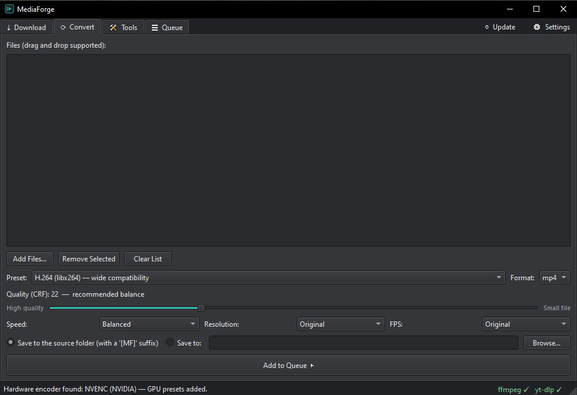

# MediaForge

A media toolbox for Windows — think HandBrake plus a YouTube downloader in one window.
It runs **ffmpeg** and **yt-dlp** in the background. Tools are looked up in this order:
custom path from Settings → `bin\` folder next to the app → PATH.



## Portable distribution

The `dist\` folder is a self-contained portable package:

```
dist\
  MediaForge.exe
  bin\
    ffmpeg.exe      (static build)
    ffprobe.exe     (static build)
    yt-dlp.exe      (standalone GitHub release — NOT the pip launcher)
```

Copy or zip the folder as it is; no installation needed. `package.bat`
compresses it into `MediaForge-portable.zip`.

Updating the tools: the **⇩ Update** button in the top right corner of the window checks
the yt-dlp and ffmpeg versions and downloads newer ones into the `bin\` folder
(yt-dlp: official GitHub release, ffmpeg: BtbN win64-gpl build).

## Running / building from source

```
pip install -r requirements.txt
python MediaForge.py
```

`build.bat` produces `dist\MediaForge.exe` with PyInstaller (it doesn't touch the `bin\` folder).

## Tabs

- **Download** — paste links (one per line), pick a format (best quality /
  1080p / 720p / MP3), playlist support, embedding cover art and metadata in audio files.
- **Convert** — drag and drop files, pick a preset (H.264 / H.265 / AV1 / remux / MP3),
  CRF quality slider, speed, resolution and FPS. Hardware encoders are tested at startup
  and presets for the working ones are added automatically: NVIDIA (NVENC), AMD (AMF), Intel (QSV) —
  H.264, H.265 and AV1 on cards that support it.
- **Tools** — media info (ffprobe), lossless or frame-accurate trimming, extracting audio from video,
  joining videos (lossless concat, or re-encoding that matches different sources).
- **Queue** — every job in one table: progress bar, speed, remaining time, pause/resume,
  cancel, log (double-click a row to see the ffmpeg/yt-dlp output).

## Notes

- Settings are stored in `settings.json` (in the app folder). Settings from older versions
  (`ayarlar.json`) are migrated automatically on first start.
- How many downloads/conversions run at the same time can be changed in Settings.
- Converted files are written to the source folder with a `[MF]` suffix (a fixed folder can be chosen instead).
